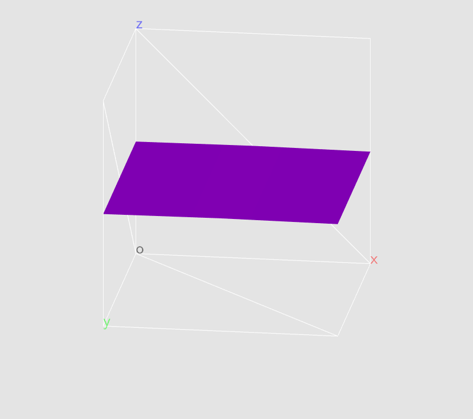

# 3DFG
Work in progress 3D function graphing tool.

## Getting Started
### Dependencies
Requires OpenGL, [GLFW](https://www.glfw.org/), [GLAD](https://glad.dav1d.de/)\*, [GLM](https://glm.g-truc.net/0.9.9/index.html), and [ExpressionUtil](https://github.com/cxcd/Expression-Utility)\*.

\*included

### Running
Compile and run using Visual Studio 2019 or later.
